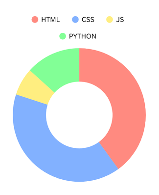

### Hey there 👋

I am a hobby web developer.

What started as "playing around" has turned into an obsession. Right now, I'm diving into Python within Fedora workflow. At the same time, I'm wrestling with CSS to ensure that my projects not only function well but also look good. 

What's next? I don't know, probably a new website project or something to put my new Hopeful Python skills to use.

#### Tools I use daily

 
